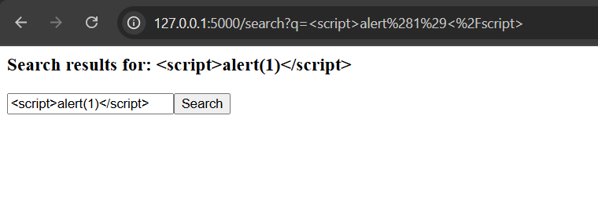
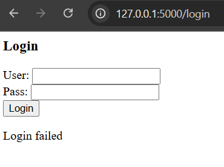
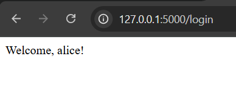

# Secure Web Application (Flask)
This project demonstrates how common web vulnerabilities can be exploited and securely fixed in a small Flask-based web application.  
The project includes:

- SQL Injection prevention  
- Cross-Site Scripting (XSS) prevention  
- Secure password hashing using bcrypt  
- Logging of authentication and search events  
- Screenshots demonstrating each fix  

All testing was done inside WSL2 (Ubuntu) on Windows.

---

## Features Implemented

### 1. SQL Injection Prevention
User input is handled using **parameterized SQL queries**, preventing attackers from injecting SQL code.

### 2. XSS Prevention
All user-supplied data in the search feature is automatically **escaped** before rendering, blocking malicious scripts.

### 3. Secure Password Storage
Passwords are hashed using **bcrypt** before being stored in the SQLite database.

### 4. Event Logging
Authentication attempts and search queries are recorded in `app.log`.

---

## Project Structure
vuln_web_project/
│
├── vuln_app.py # Main Flask app
├── vuln.db # SQLite DB (auto-created)
├── app.log # Login & search logs
├── README.md # Documentation
│
├── search_test.png # XSS prevention screenshot
├── login_failed.png # SQL injection prevention screenshot
└── login_success.png # Successful login screenshot
---

## How to Run the Application

### 1. Activate virtual environment

cd ~/vuln_web_project
source venv/bin/activate

### 2. Start the application
python3 vuln_app.py


### 3. Access the app at:

http://127.0.0.1:5000
---

## Security Test Evidence (Screenshots)

### ✔ XSS Prevention Test  
The `<script>alert(1)</script>` payload is displayed safely as plain text instead of executing any JavaScript.



---

### ✔ SQL Injection Prevention Test  
Attempting `alice' --` correctly results in login failure, confirming SQL injection protection.



---

### ✔ Successful Login  
Valid credentials authenticate successfully, confirming bcrypt password hashing and verification.



---

## Logging

The application logs key events such as:

- Login attempts (success and failure)  
- SQL injection attempts  
- XSS input attempts  
- All search queries  

To view logs live:

```bash
tail -f app.log

